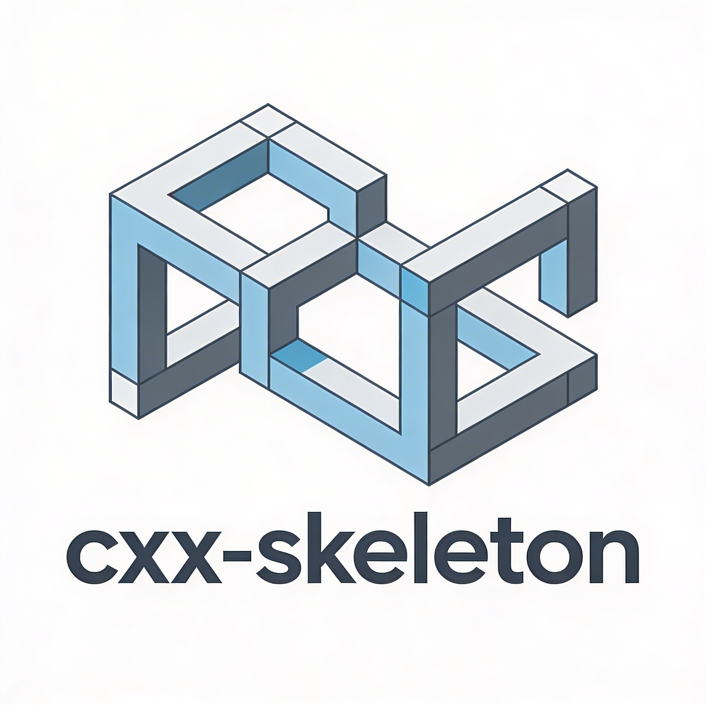

# cmake_template

<p align="center">
  
</p>

<p align="center">
  <a href="https://isocpp.org/"></a>
  <a href="https://cmake.org"></a>
  <a href="license.md"></a>
</p>

Modern C++ project template. Ninja Multi-Config, CPM, CPack, cross-compilation, code quality tooling — zero friction from clone to package.

## Quick Start

```bash
cmake --preset=gcc
cmake --build --preset=gcc-release
ctest --preset=gcc-release
```

Full pipeline (configure → build → test → package):

```bash
cmake --workflow --preset=gcc-full
```

## Prerequisites

```
cmake 3.31+
ninja 1.11+
C++23-capable compiler (clang 16+, gcc 13+, msvc 19.35+)
```

### macOS

```bash
brew install cmake llvm ninja doxygen
```

### Linux (Fedora)

```bash
sudo dnf install cmake gcc-c++ ninja-build doxygen llvm clang-tools-extra
```

### Linux (Ubuntu/Debian)

```bash
sudo apt install cmake g++ ninja-build doxygen llvm clang-tools
```

### Windows

```powershell
choco install cmake llvm ninja doxygen visualstudio2022buildtools
```

## Presets

All presets use **Ninja Multi-Config** (except `msvc` → Visual Studio 17 2022).

### Configure

| Preset | Compiler | Platform | Notes |
| :-- | :-- | :-- | :-- |
| `gcc` | GCC/G++ | Native | — |
| `clang` | Clang/Clang++ | Native | — |
| `msvc` | MSVC (VS 2022) | Windows | x64 arch, x64 host toolset |
| `android-arm64` | NDK | Android | arm64-v8a, API 24 |
| `android-arm32` | NDK | Android | armeabi-v7a, API 24 |
| `android-x64` | NDK | Android | x86_64 (emulator) |
| `android-x86` | NDK | Android | x86 (emulator) |
| `llvm-mingw-x86_64` | LLVM-MinGW | Linux → Windows | 64-bit cross-compilation |
| `llvm-mingw-i686` | LLVM-MinGW | Linux → Windows | 32-bit cross-compilation |
| `llvm-mingw-aarch64` | LLVM-MinGW | Linux → Windows | ARM64 cross-compilation |

### Build

```bash
cmake --build --preset=<name>-release
cmake --build --preset=<name>-debug
```

Available: `gcc-release`, `gcc-debug`, `clang-release`, `clang-debug`, `msvc-release`, `msvc-debug`, `android-arm64`, `android-arm32`, `android-x64`, `android-x86`, `llvm-mingw-x86_64`, `llvm-mingw-i686`, `llvm-mingw-aarch64`.

### Test

```bash
ctest --preset=<name>-release
```

Available: `gcc-release`, `gcc-debug`, `clang-release`, `clang-debug`, `msvc-release`, `msvc-debug`. Tests are disabled for cross-compiled targets.

### Package (CPack)

```bash
cpack --preset=<name>-package
```

| Preset | Format |
| :-- | :-- |
| `gcc-package` | `.tar.gz` |
| `clang-package` | `.tar.gz` |
| `msvc-package` | `.zip` |
| `llvm-mingw-*-package` | `.tar.xz` |

### Workflows

Full pipelines (configure → build → test → package) in a single command:

```bash
cmake --workflow --preset=gcc-full
cmake --workflow --preset=clang-full
cmake --workflow --preset=msvc-full
cmake --workflow --preset=android-arm64-full    # configure + build only
cmake --workflow --preset=llvm-mingw-x86_64-full # configure + build + package (no test)
```

## Project Structure

```
.
├── CMakeLists.txt
├── CMakePresets.json
├── cmake/                  # find_package modules (warnings, cpm, code quality)
├── src/                    # application sources
├── tests/                  # doctest + CTest
├── tools/                  # helper scripts
├── docker/                 # Dockerfiles for reproducible builds
├── android-project/        # Android project scaffolding
├── .clang-format           # clang-format config
├── .clang-tidy             # clang-tidy config
├── .cmake-format.yaml      # cmake-format config
├── .editorconfig           # editor defaults
├── .pre-commit-config.yaml # pre-commit hooks
└── license                 # MIT
```

## Code Quality

Format sources and CMake files:

```bash
cmake --build build/gcc --target format
```

Static analysis:

```bash
cmake --build build/gcc --target tidy
```

Lint:

```bash
cmake --build build/gcc --target cpplint
```

Pre-commit hooks enforce formatting on every commit. Install once:

```bash
pre-commit install
```

## Documentation

```bash
cmake --build build/gcc --target doxygen
```

Output: `build/gcc/docs/doxygen/html`.

## Docker

```bash
docker build -t cxx-skeleton -f docker/fedora.Dockerfile .
docker run --rm -v "$(pwd):/src" cxx-skeleton cmake --workflow --preset=gcc-full
```

## Android

Set `ANDROID_NDK_HOME` and run:

```bash
export ANDROID_NDK_HOME=/path/to/ndk
cmake --workflow --preset=android-arm64-full
```

## Cross-Compilation (Linux → Windows)

Requires [llvm-mingw](https://github.com/mstorsjo/llvm-mingw) on `PATH`:

```bash
cmake --workflow --preset=llvm-mingw-x86_64-full
```

## Dependencies

Managed via [CPM](https://github.com/cpm-cmake/CPM.cmake). Add packages in CMakeLists.txt:

```cmake
CPMAddPackage("gh:fmtlib/fmt#11.1.4")
```

CPM downloads are verbose (`FETCHCONTENT_QUIET=OFF`) for CI visibility.

## IDE Support

The project generates `compile_commands.json` and is compatible with CLion, Visual Studio, QtCreator, KDevelop, and any LSP-based editor.

## References

### Standards & Drafts
- **[C++ Core Guidelines](https://isocpp.github.io/CppCoreGuidelines/)** — Authoritative coding standard maintained by Stroustrup & Sutter [isocpp/CppCoreGuidelines](https://github.com/isocpp/CppCoreGuidelines)
- **[cppreference.com](https://en.cppreference.com/)** — Community-driven language and standard library reference
- **[DevDocs C++](https://devdocs.io/cpp/)** — Aggregated, offline-capable API documentation
- **[C++ Draft Standard](https://eel.is/c++draft)** — Current ISO working draft with full wording
- **[HTML Standard Archive](https://timsong-cpp.github.io/cppwp)** — Formatted archive of prior C++ standard drafts
- **[cppdraft/search](https://github.com/cppdraft/search)** — Indexed full-text search over the standard draft [cppdraft/search](https://github.com/cppdraft/search)
- **[search.cpp-lang.org](https://search.cpp-lang.org)** — Alternative search portal for C++ draft and proposals
- **[cppstdmd](https://github.com/cppstdmd/cppstdmd)** — Markdown-formatted version of the C++ standard text [cppstdmd/cppstdmd](https://github.com/cppstdmd/cppstdmd)
- **[WG21](https://wg21.link)** — Committee proposal shortener and paper lookup
- **[C++ Evolution](https://cppevo.dev)** — Visual feature tracker from C++98 through C++26
- **[C++ Standard Adventure](https://cppevo.dev/adventure)** — Interactive text-game presentation of standard features
- **[cppstat.dev](https://cppstat.dev)** — Compiler feature implementation statistics across vendors
- **[C++20 → C++23](https://cpp23.damonrevoe.com/)** — Structured overview of changes and additions per standard cycle
- **[C++ Compiler Support](https://en.cppreference.com/w/cpp/compiler_support)** — Vendor feature matrix for the latest standards
- **[endoflife.date](https://endoflife.date/)** — End-of-life dates for compilers, libraries, and platforms

### Build, CMake & Packaging
- **[CMake Documentation](https://cmake.org/cmake/help/latest/)** — Official command and variable reference [Kitware/CMake](https://github.com/Kitware/CMake)
- **[Modern CMake](https://cliutils.gitlab.io/modern-cmake/)** — Practical guide to idiomatic, target-based CMake
- **[CMake Cookbook](https://github.com/dev-cafe/cmake-cookbook)** — Ready-to-use recipes for real-world build problems [dev-cafe/cmake-cookbook](https://github.com/dev-cafe/cmake-cookbook)
- **[CMake Template](https://github.com/cpp-best-practices/cmake_template)** — Opinionated, production-ready starter layout [cpp-best-practices/cmake_template](https://github.com/cpp-best-practices/cmake_template)
- **[CPM.cmake](https://github.com/cpm-cmake/CPM.cmake)** — Zero-configuration CMake dependency management [cpm-cmake/CPM.cmake](https://github.com/cpm-cmake/CPM.cmake)
- **[Ninja](https://ninja-build.org/)** — Fast, low-level build executor designed for generated files [ninja-build/ninja](https://github.com/ninja-build/ninja)
- **[ccache](https://github.com/ccache/ccache)** — Compiler cache that speeds up rebuilds via object caching [ccache/ccache](https://github.com/ccache/ccache)
- **[sccache](https://github.com/mozilla/sccache)** — Mozilla's distributed compiler cache with cloud backend support [mozilla/sccache](https://github.com/mozilla/sccache)
- **[mold](https://github.com/rui314/mold)** — Fast drop-in linker outperforming GNU ld and LLVM lld [rui314/mold](https://github.com/rui314/mold)
- **[vcpkg](https://github.com/microsoft/vcpkg)** — Cross-platform Microsoft package manager for C/C++ [microsoft/vcpkg](https://github.com/microsoft/vcpkg)
- **[Conan](https://github.com/conan-io/conan)** — Decentralized C/C++ package manager with strong CMake integration [conan-io/conan](https://github.com/conan-io/conan)
- **[Buck2](https://github.com/facebook/buck2)** — Meta's fast, multi-language build system with C++ support [facebook/buck2](https://github.com/facebook/buck2)
- **Хабр: Создаем свою простую (C++) библиотеку с документацией, CMake и блекджеком** — Practical walkthrough of a documented CMake library release

### Build Profiling & Tracing
- **[Clang `-ftime-trace`](https://clang.llvm.org/docs/UsersManual.html#time-trace)** — Generates Chrome-trace `.json` for per-compilation profiling; use `clang++ -ftime-trace` [llvm/llvm-project](https://github.com/llvm/llvm-project)
- **[CMake profiling](https://cmake.org/cmake/help/latest/manual/cmake.1.html#profiling)** — Native profiling output in Google Trace format via `cmake --profiling-output=trace.json --profiling-format=google-trace` [Kitware/CMake](https://github.com/Kitware/CMake)
- **[Perfetto UI](https://ui.perfetto.dev)** — Advanced trace visualization for build and runtime profiling [google/perfetto](https://github.com/google/perfetto)
- **[Chrome Tracing](chrome://tracing)** — Built-in Chromium viewer for JSON trace events

### Debuggers & Execution Control
- **[LLDB](https://lldb.llvm.org/)** — LLVM native debugger with scriptable Python/C++ APIs [llvm/llvm-project](https://github.com/llvm/llvm-project)
- **[GDB](https://www.gnu.org/software/gdb/)** — GNU Project debugger supporting remote and embedded targets [bminor/binutils-gdb](https://github.com/bminor/binutils-gdb)
- **[x64dbg](https://x64dbg.com/)** — Open-source Windows x64/x32 debugger for reverse engineering and malware analysis [x64dbg/x64dbg](https://github.com/x64dbg/x64dbg)
- **[RemedyBG](https://remedybg.itch.io/remedybg)** — Lightweight, fast Windows debugger designed for game development
- **[WinDbg](https://learn.microsoft.com/windows-hardware/drivers/debugger/)** — Microsoft's kernel-mode and user-mode Windows debugger
- **[rr](https://rr-project.org/)** — Mozilla's record-and-replay debugger for non-deterministic debugging
- **[raddbg](https://github.com/EpicGames/raddbg)** — Epic Games visual debugger focused on C/C++ data-oriented inspection [EpicGames/raddbg](https://github.com/EpicGames/raddbg)

### Reverse Engineering & Disassembly
- **[Ghidra](https://ghidra-sre.org/)** — NSA-developed software reverse engineering framework with decompiler and scripting [NationalSecurityAgency/ghidra](https://github.com/NationalSecurityAgency/ghidra)
- **[Cutter](https://cutter.re/)** — Qt-based GUI for Rizin/Radare2 reverse engineering [rizinorg/cutter](https://github.com/rizinorg/cutter)
- **[Rizin](https://rizin.re/)** — UNIX-like reverse engineering framework and command-line toolset [rizinorg/rizin](https://github.com/rizinorg/rizin)
- **[radare2](https://www.radare.org/)** — Complete UNIX-like framework for reverse engineering and binary analysis [radareorg/radare2](https://github.com/radareorg/radare2)
- **[Binary Ninja](https://binary.ninja/)** — Multi-platform interactive disassembler, decompiler, and binary analysis platform [Vector35/binaryninja-api](https://github.com/Vector35/binaryninja-api)
- **[Decompiler Explorer](https://dogbolt.org/)** — Side-by-side comparison of decompiler outputs from multiple engines

### Online Tooling & Playgrounds
- **[Compiler Explorer](https://godbolt.org/)** — Live assembly exploration across compilers and architectures; created by Matt Godbolt [compiler-explorer/compiler-explorer](https://github.com/compiler-explorer/compiler-explorer)
- **[Matt Godbolt — What Has My Compiler Done for Me Lately](https://www.youtube.com/watch?v=bSkpMdDe4g4)** — Seminal talk on reading and understanding compiler-generated assembly
- **[C++ Insights](https://cppinsights.io/)** — See template instantiations and compiler transformations [andreasfertig/cppinsights](https://github.com/andreasfertig/cppinsights)
- **[Quick C++ Benchmark](https://quick-bench.com/)** — Online micro-benchmark playground [FredTingaud/quick-bench](https://github.com/FredTingaud/quick-bench)
- **[C++ Shell](https://cpp.sh/)** — Interactive online REPL for quick snippets
- **[Wandbox](https://wandbox.org/)** — Online compiler supporting multiple GCC/Clang versions and Boost
- **[Carbon](https://carbon.now.sh/)** — Generate beautiful shareable images of source code
- **[cdecl](https://cdecl.org/)** — Translate C and C++ declarations between gibberish and English
- **[Decompiler Explorer](https://dogbolt.org/)** — Side-by-side decompiler output comparison

### Code Quality, Sanitizers & Analysis
- **[Clangd](https://clangd.llvm.org/)** — LLVM language server for IDE completion, navigation, and refactoring [llvm/llvm-project](https://github.com/llvm/llvm-project)
- **[Clang-Tidy](https://clang.llvm.org/extra/clang-tidy/)** — Extensible linting with modern C++ checks and auto-fixes [llvm/llvm-project](https://github.com/llvm/llvm-project)
- **[Clang Static Analyzer](https://clang-analyzer.llvm.org/)** — Source-level bug detection for C, C++, and Objective-C
- **[ClangFormat Xcode](https://github.com/travisjeffery/ClangFormat-Xcode)** — Xcode integration for consistent automated formatting [travisjeffery/ClangFormat-Xcode](https://github.com/travisjeffery/ClangFormat-Xcode)
- **[cppcheck](https://github.com/danmar/cppcheck)** — Fast, open-source static analysis for C/C++ [danmar/cppcheck](https://github.com/danmar/cppcheck)
- **[PVS-Studio](https://pvs-studio.com/)** — Deep static analyzer with detailed C++ diagnostics
- **[include-what-you-use](https://include-what-you-use.org/)** — Optimize header inclusion via accurate dependency analysis [include-what-you-use/include-what-you-use](https://github.com/include-what-you-use/include-what-you-use)
- **[Google Sanitizers](https://github.com/google/sanitizers)** — AddressSanitizer, ThreadSanitizer, MemorySanitizer, and UBSan [google/sanitizers](https://github.com/google/sanitizers)
- **[Valgrind](https://valgrind.org/)** — Instrumentation framework for memory debugging, leak detection, and profiling [Valgrind](https://valgrind.org/)
- **[DynamoRIO](https://dynamorio.org/)** — Runtime code manipulation system for dynamic instrumentation and analysis [DynamoRIO/dynamorio](https://github.com/DynamoRIO/dynamorio)

### Testing & Benchmarking
- **[Catch2](https://github.com/catchorg/Catch2)** — Modern, header-only capable C++ test framework [catchorg/Catch2](https://github.com/catchorg/Catch2)
- **[GoogleTest](https://github.com/google/googletest)** — Google's xUnit-style testing and mocking framework [google/googletest](https://github.com/google/googletest)
- **[doctest](https://github.com/doctest/doctest)** — Light, fast single-header testing library [doctest/doctest](https://github.com/doctest/doctest)
- **[Google Benchmark](https://github.com/google/benchmark)** — Robust micro-benchmarking supporting complexity analysis [google/benchmark](https://github.com/google/benchmark)
- **[Quick C++ Benchmark](https://quick-bench.com/)** — Online micro-benchmark playground [FredTingaud/quick-bench](https://github.com/FredTingaud/quick-bench)

### Performance & Architecture
- **[Performance-Aware Programming](https://www.computerenhance.com/)** — Casey Muratori's course on software performance
- **[Agner Fog](https://agner.org/optimize)** — Authoritative microarchitecture, calling conventions, and instruction tables
- **[uops.info](https://uops.info/)** — Independent instruction latency and throughput measurements
- **[1024cores](https://www.1024cores.net/)** — Dmitry Vyukov's lock-free programming and scalable architecture guide
- **[Preshing on Programming](https://preshing.com/)** — Jeff Preshing's articles on atomics and lock-free code
- **[IntroX86](https://gitlab.com/mortbopet/introx86)** — 64-bit x86 assembly and low-level programming primer
- **[You Can Do Any Kind of Atomic Read-Modify-Write Operation](https://preshing.com/20150402/you-can-do-any-kind-of-atomic-read-modify-write-operation/)** — Lock-free primitive overview and standard guarantees
- **[C/C++: 70x faster file embeds using string literals](https://mortbopet.net/posts/2024/c++-file-embeds/)** — Compile-time resource embedding via string literals

### Libraries & Ecosystem
- **[userver](https://github.com/userver-framework/userver)** — Yandex high-performance asynchronous C++ framework with coroutines [userver-framework/userver](https://github.com/userver-framework/userver)
- **[PFR](https://github.com/boostorg/pfr)** — Boost.PFR for precise and flat reflection by Anton Polukhin [boostorg/pfr](https://github.com/boostorg/pfr)
- **[Anton Polukhin](https://github.com/apolukhin)** — Core contributor to Boost, reflection, and modern C++ tooling [apolukhin](https://github.com/apolukhin)
- **[Abseil](https://github.com/abseil/abseil-cpp)** — Google's open-source C++ common libraries [abseil/abseil-cpp](https://github.com/abseil/abseil-cpp)
- **[Folly](https://github.com/facebook/folly)** — Facebook's core C++ library optimized for performance and practicality [facebook/folly](https://github.com/facebook/folly)
- **[Seastar](https://github.com/scylladb/seastar)** — High-performance C++ framework for I/O intensive async apps [scylladb/seastar](https://github.com/scylladb/seastar)
- **[brpc](https://github.com/apache/brpc)** — Industrial-grade RPC framework used throughout Baidu [apache/brpc](https://github.com/apache/brpc)
- **[fmt](https://github.com/fmtlib/fmt)** — Modern formatting library that inspired `std::format` [fmtlib/fmt](https://github.com/fmtlib/fmt)
- **[spdlog](https://github.com/gabime/spdlog)** — Fast, header-only/compiled C++ logging library [gabime/spdlog](https://github.com/gabime/spdlog)
- **[nlohmann/json](https://github.com/nlohmann/json)** — Intuitive JSON for Modern C++ with STL-like interface [nlohmann/json](https://github.com/nlohmann/json)
- **[range-v3](https://github.com/ericniebler/range-v3)** — Range library providing views and actions for C++20/23 preview [ericniebler/range-v3](https://github.com/ericniebler/range-v3)
- **[Boost](https://github.com/boostorg/boost)** — Widely used collection of peer-reviewed portable C++ libraries [boostorg/boost](https://github.com/boostorg/boost)
- **[Dear ImGui Bundle](https://github.com/pthom/imgui_bundle)** — Batteries-included ImGui ecosystem with bindings and docs [pthom/imgui_bundle](https://github.com/pthom/imgui_bundle)
- **[Awesome C++](https://github.com/fffaraz/awesome-cpp)** — Curated comprehensive list of frameworks, libraries, and resources [fffaraz/awesome-cpp](https://github.com/fffaraz/awesome-cpp)
- **Хабр: Тысяча и одна библиотека С++** — Curated Russian-language overview of useful C++ libraries

### Compiler Docs & Standard Libraries
- **[Clang](https://clang.llvm.org/docs)** — LLVM/Clang driver, attributes, and language extensions [llvm/llvm-project](https://github.com/llvm/llvm-project)
- **[GCC](https://gcc.gnu.org/onlinedocs)** — GNU Compiler Collection online manuals
- **[MSVC](https://learn.microsoft.com/cpp)** — Microsoft C++ language and library reference
- **[libc++](https://libcxx.llvm.org/)** — LLVM implementation of the C++ standard library [llvm/llvm-project](https://github.com/llvm/llvm-project)
- **[Microsoft STL](https://github.com/microsoft/STL)** — MSVC standard library implementation on GitHub [microsoft/STL](https://github.com/microsoft/STL)

### Profiling & Runtime Inspection
- **[Perfetto UI](https://ui.perfetto.dev)** — Advanced trace visualization for build and runtime profiling [google/perfetto](https://github.com/google/perfetto)
- **[Tracy](https://github.com/wolfpld/tracy)** — Real-time, nanosecond-resolution frame and zone profiler [wolfpld/tracy](https://github.com/wolfpld/tracy)
- **[Optick](https://github.com/bombomby/optick)** — Lightweight C++ profiler with GPU and instrumentation support [bombomby/optick](https://github.com/bombomby/optick)
- **[Hotspot](https://github.com/KDE/hotspot)** — Linux perf GUI for visualizing performance data and flame graphs [KDE/hotspot](https://github.com/KDE/hotspot)
- **[Heaptrack](https://github.com/KDE/heaptrack)** — Fast memory profiler for Linux recording all malloc/free operations [KDE/heaptrack](https://github.com/KDE/heaptrack)
- **[BCC](https://github.com/iovisor/bcc)** — BPF-based performance analysis toolkit and eBPF scripts [iovisor/bcc](https://github.com/iovisor/bcc)
- **[RenderDoc](https://renderdoc.org/)** — Standalone graphics debugger for frame capture and GPU analysis [baldurk/renderdoc](https://github.com/baldurk/renderdoc)

### Community, Talks & People
- **[C++ Weekly](https://youtube.com/@cppweekly)** — Jason Turner's concise weekly tips and modern techniques
- **[CppCon](https://youtube.com/@CppCon)** — Annual conference talks covering advanced and upcoming features
- **[C++ Stories](https://www.cppstories.com)** — Bartek Filipek's in-depth articles on modern C++
- **[Meeting C++](https://meetingcpp.com/)** — European C++ conference and community hub
- **[Latest News | The C++ Alliance](https://cppalliance.org/news/)** — Foundation news, Boost updates, and standardization resources
- **[Handmade Hero](https://handmadehero.org)** — Casey Muratori's guided low-level game programming series
- **[Sean Parent — Better Code](https://www.youtube.com/@seanparent)** — Talks on value semantics, generic programming, and efficiency [seanparent](https://github.com/seanparent)
- **[Chandler Carruth — Efficient Programming with Components](https://www.youtube.com/watch?v=mdhP8OAz1D8)** — LLVM lead talks on performance and compiler-aware design
- **[Eric Niebler](https://ericniebler.com/)** — Ranges, customization point objects, and standardization deep-dives [ericniebler/range-v3](https://github.com/ericniebler/range-v3)
- **[Barry's C++ Blog](https://brevzin.github.io/)** — Detailed posts on niebloids, metaclasses, and language evolution
- **[What are niebloids?](https://www.sandordargo.com/blog/2021/04/07/what-are-niebloids)** — Beginner-friendly breakdown of C++ customization point objects
- **[MaskRay](https://maskray.me/)** — Blog covering linkers, LLVM internals, and toolchain engineering
- **[Howard Hinnant](https://howardhinnant.github.io/)** — Author of `std::chrono`/`date.h` and seminal C++ timing articles [HowardHinnant/date](https://github.com/HowardHinnant/date)

### Learning Paths
- **[Learn C++](https://www.learncpp.com/)** — Free, comprehensive tutorial series from basics through advanced topics
- **[Learn X in Y Minutes: C++](https://learnxinyminutes.com/docs/c++/)** — Condensed syntax and feature tour for quick reference
- **[Курс по разработке 64-битных приложений на языке C и C++](https://www.viva64.com/ru/a/0012/)** — Course on 64-bit C/C++ development pitfalls and practices
